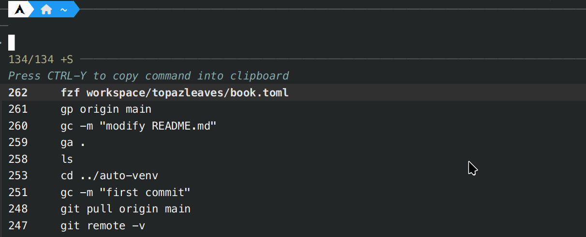

### Introduction

A plugin for oh-my-zsh integrate fzf.

You can use some hotkeys in termimal to call fzf.

- `Ctrl-R`: search history
- `Ctrl-T`: search file
- `Alt-C` : search folder



### Installation

1. Ensure you have installed [fzf](https://github.com/junegunn/fzf).

2. Clone this repository into your oh-my-zsh plugins folder.

```bash
git clone https://github.com/lxp731/fzf-hotkey.git "$ZSH_CUSTOM/plugins/fzf-hotkey"
```

Then add this line to your `.zshrc`. Make sure it is before the line source `$ZSH/oh-my-zsh.sh`.
```bash
plugins=(
    ...
    fzf-hotkey
)
```